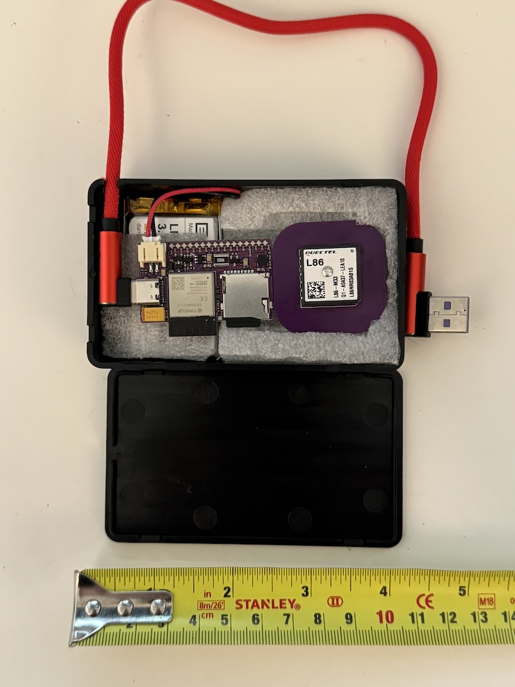

# Case and accessory options

The GPS logger board is designed to be used in your own projects, but here are some options that work well to create a self-contained unit.

## Case options

A small electronics project box [Example here](https://www.amazon.co.uk/dp/B08HLWB9YJ) can be used. The example given fits the battery nicely,
and packed with some foam avoids any rattling. It won't be waterproof, but it makes a neat package about the size of a pack of cards that can
be put in a car glovebox or similar.

It also fits a right-angle USB-C cable such as [this](https://www.amazon.co.uk/dp/B07SX281CH), although this requires drilling a small (~4mm)
hole in the side before fitting the lid.

## Battery

Only tested with a 3.7v 2000mAh 103454 LiPo battery: [Example here](https://www.amazon.co.uk/dp/B08214DJLJ)
